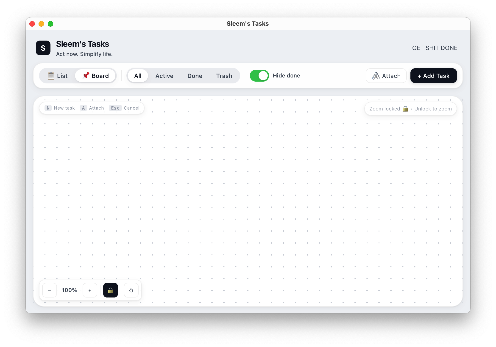
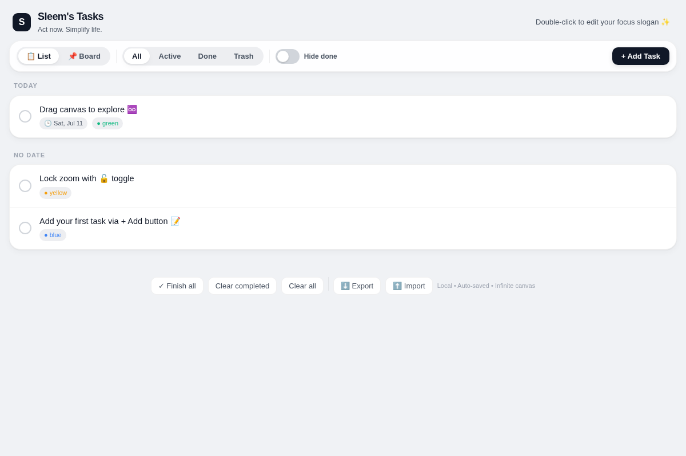
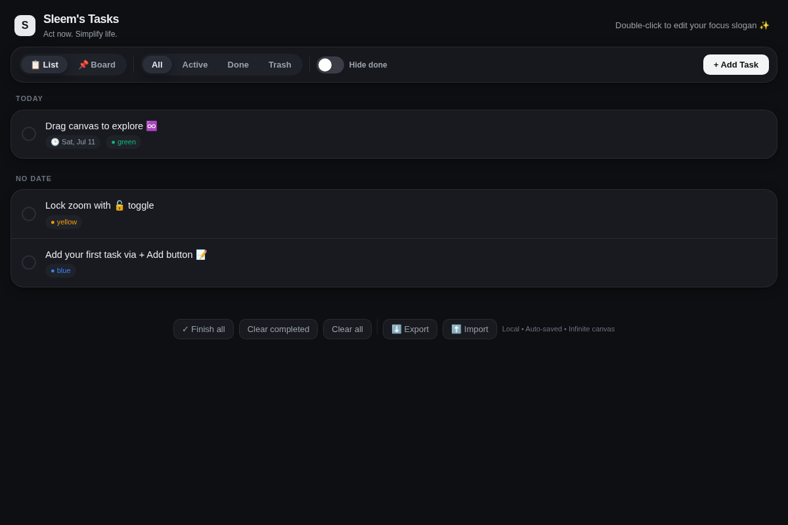
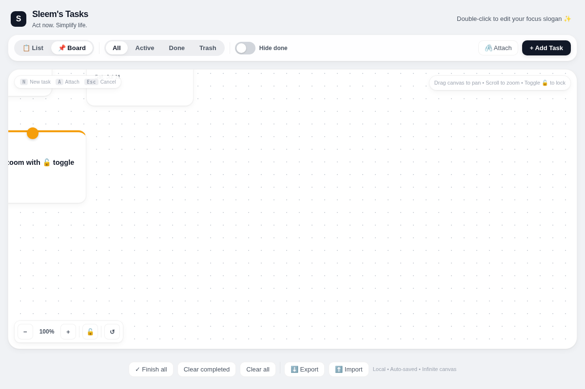
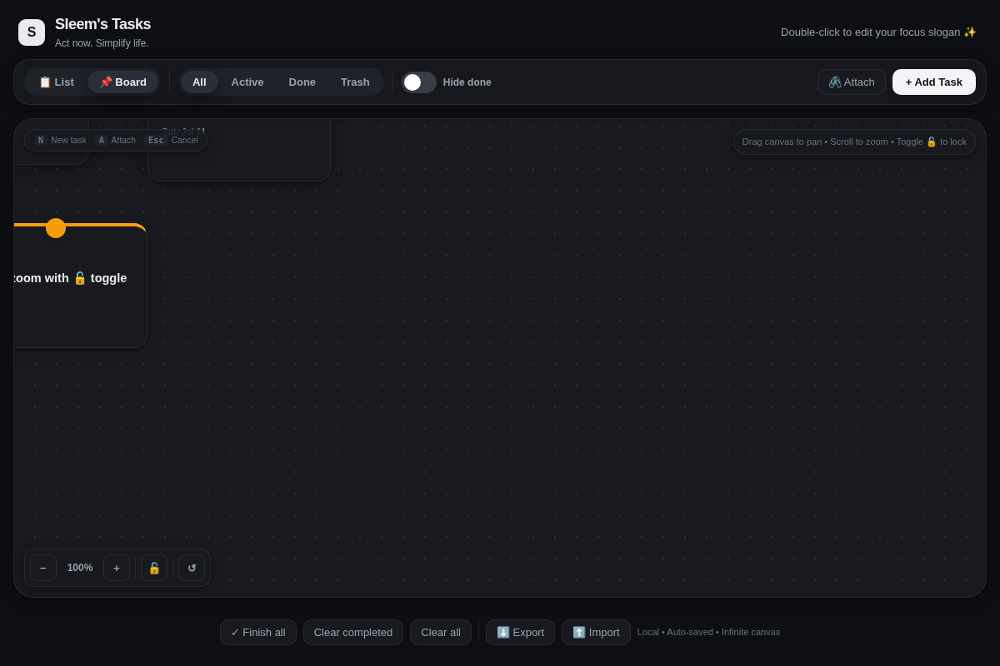

# Sleem's Tasks ✅

A clean, minimalist task manager I built for myself — because sometimes you just need to get things done without the bloat.

List view for structure, Board view for chaos. Infinite canvas, colored pins, local-first. No accounts, no servers, no nonsense.

## Screenshots

| Light Mode | Dark Mode |
|:---:|:---:|
|  |  |
|  |  |

## Download (macOS)

1. Download [`Sleems-Tasks-macOS.zip`](dist/Sleems-Tasks-macOS.zip) from this repo (or grab it from [Releases](https://github.com/Ahmed-Sleem/sleems-tasks/releases))
2. Unzip it
3. Move **Sleem's Tasks.app** to your Applications folder
4. On first open: Right-click → Open (macOS security thing)

## Features

- 📋 **List view** — grouped by date, drag to reorder
- 📌 **Board view** — infinite canvas with sticky notes, pan & zoom
- 🎨 Color-coded pins (Red, Blue, Green, Purple, Yellow)
- 🖇️ Connect tasks on the board
- 🌙 Auto light/dark mode
- 🔘 iOS-style toggle to hide completed tasks
- 💾 100% local, auto-saved
- ⬇️ Export / ⬆️ Import

## Keyboard Shortcuts

| Key | Action |
|-----|--------|
| `N` | New task |
| `A` | Attach mode (Board) |
| `Esc` | Cancel / Close |

## Built With

- [Tauri](https://tauri.app/) + vanilla HTML/CSS/JS
- Rust backend for file persistence

## License

MIT
